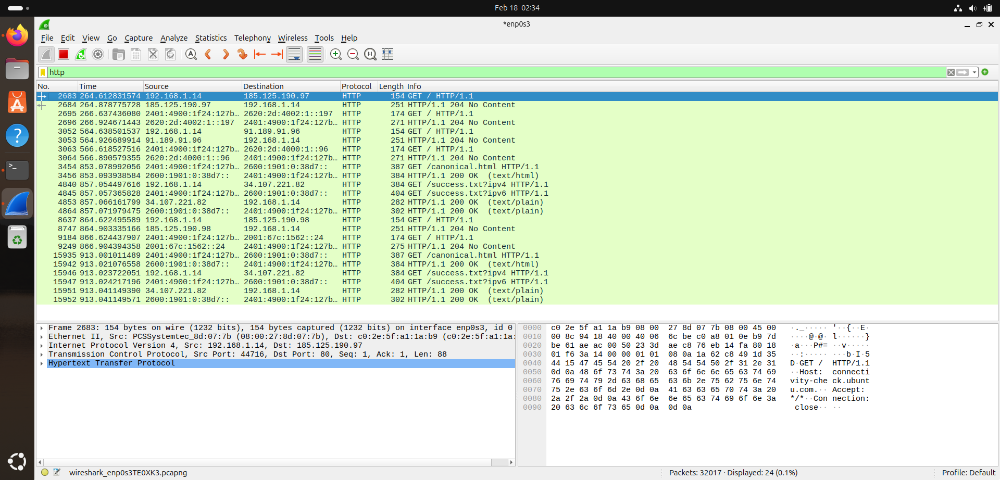
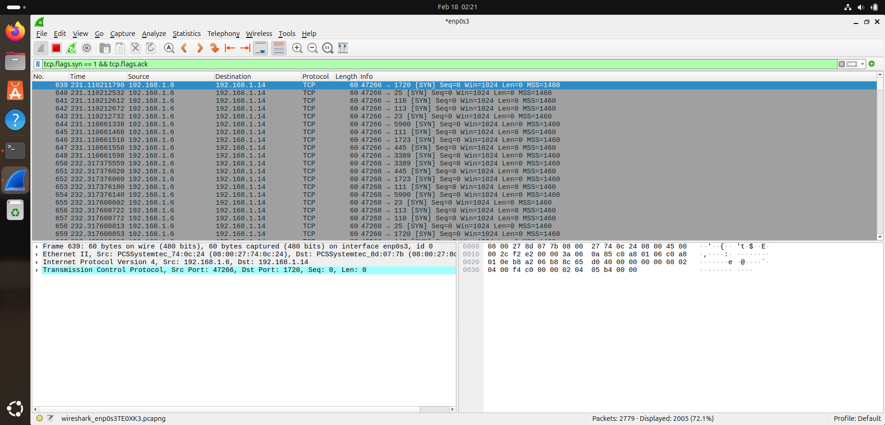
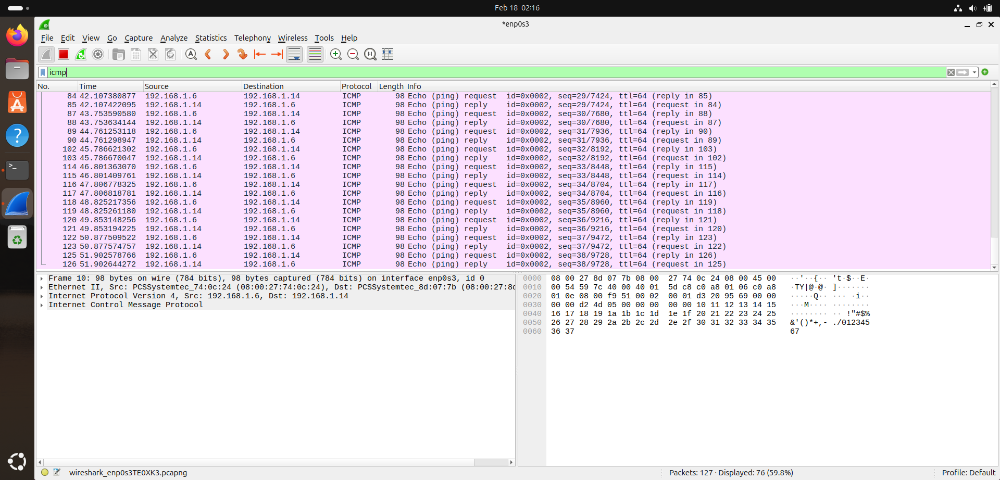
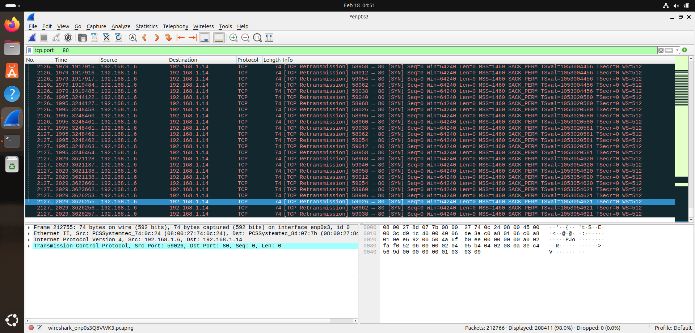
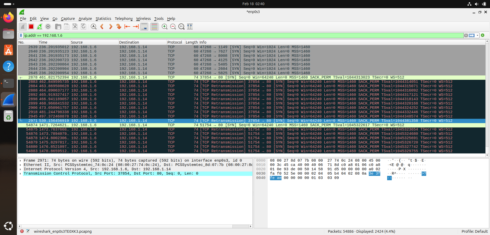
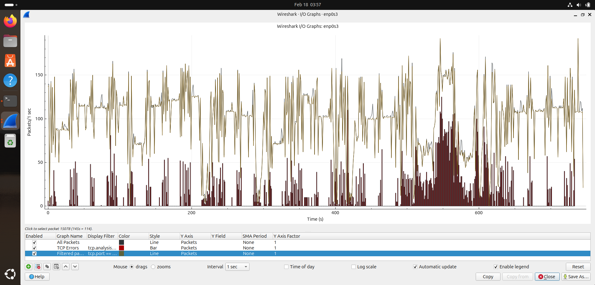

# Wireshark_Traffic_Analysis_Lab - Network Traffic Analysis Laboratory: Capturing & Analyzing ICMP, TCP, and HTTP Traffic with Wireshark
  ------------------------------
Project Overview
----------------
🔹This laboratory project provides a hands-on examination of network communications by capturing and analyzing live traffic between two Linux-based systems. Using Wireshark as the primary analysis tool, I established a controlled testing environment consisting of a Kali Linux machine (acting as the source/attacker) and an Ubuntu machine (acting as the target/victim) to observe, filter, and interpret various network protocols at the packet level.

🔹The objective was to move beyond theoretical networking concepts by visualizing real-time data transmission, understanding protocol behaviors, and identifying security implications observable through traffic analysis. Throughout this project, I systematically generated and captured multiple traffic types to build a comprehensive understanding of how data moves across networks and how malicious activities can be detected.

🔍 Traffic Analysis Fundamentals
   =============================
🔹ICMP Traffic Analysis: Generated and analyzed ping requests/responses between Kali and Ubuntu systems

🔹Wireshark Graph Utilization: Created and interpreted various Wireshark graphs (I/O Graphs, Flow Graphs) to visualize network traffic patterns

🔹Packet Filtering: Implemented display and capture filters to isolate specific traffic types and reduce noise

📡 Network Protocols & Communications
   ===================================
🔹TCP Three-Way Handshake: Captured and analyzed the complete SYN, SYN-ACK, ACK handshake process

🔹HTTP Traffic: Monitored and inspected unencrypted HTTP request/response cycles

🔹Packet-Level Analysis: Examined packet headers, payloads, and protocol-specific fields

🔐 Security Assessment Techniques
   ==============================
   
🔹SYN Scanning: Performed and identified port scanning activities, understanding how attackers map network services

🔹Traffic Pattern Recognition: Distinguished between legitimate traffic and potential malicious activities

Technical Environment:

🔹Attack Machine: Kali Linux

🔹Target Machine: Ubuntu Linux

🔹Analysis Tool: Wireshark Network Protocol Analyzer

  🌐 PROJECT SUMMARY 
  ====================

     
  Wireshark Traffic Analysis Lab
  ==============================

🔹This project focuses on analyzing network traffic in a controlled and isolated lab environment to understand TCP/IP behavior, HTTP communication, and basic attack patterns.

🔹The lab was conducted within a virtualized environment using VirtualBox, where both attacker and target machines were configured on a bridged network to simulate real-world communication. Kali Linux was used as the attacking machine, and Ubuntu served as the target system.

🔹Using Wireshark, network packets were captured and analyzed to study TCP handshakes, SYN packets, HTTP requests, retransmissions, and traffic patterns. A controlled DoS attack simulation was performed in a home lab using ddos-ripper to observe traffic spikes and server behavior under stress.

🔹Additionally, a custom Python traffic generator script was developed to send packets at a controlled rate to avoid overwhelming the server while enabling detailed packet inspection.

🔹This project demonstrates practical understanding of network protocols, packet-level analysis, traffic monitoring, and basic attack detection techniques in a safe lab setup.

1️⃣ Lab Environment Setup
=========================

 - Created isolated home lab using VirtualBox

 - Configured network settings to Bridged Mode

 - Verified IP addresses for both attacker and target machines

 - Ensured controlled and safe testing environment

   
2️⃣ Traffic Monitoring & Packet Analysis
========================================

 - Captured and analyzed TCP SYN packets,Full TCP three-way handshake and had retransmission because of port 80 protected by firewall

Identified:TCP Handshake behavior and TCP Handshake with No SYN-ACK response (Port closed or filtered) Filtered Specified IP traffic from the same IP address,
Used I/O Graph in Wireshark to monitor traffic spikes and drops.practiced on X-axis and Y-axis

3️⃣ Port 80 & Retransmission Research
=====================================

 - Conducted detailed analysis of HTTP traffic over Port 80 using Wireshark to examine request packets and server responses. Investigated TCP retransmissions to understand packet loss, network delays, and conditions leading to repeated transmissions during communication.

 - Conducted detailed analysis of HTTP traffic over Port 80 using Wireshark to examine request packets and server responses. Investigated TCP retransmissions to understand packet loss, network delays, and conditions leading to repeated transmissions during communication. Additionally, analyzed scenarios where a TCP handshake received no SYN-ACK response, identifying indications of closed or filtered ports and firewall-based traffic control.

4️⃣ Controlled DoS Simulation (Home Lab)
=======================================

 - Performed a controlled DoS simulation within an isolated virtual lab using ddos-ripper to generate high traffic for analysis purposes. Monitored packet flow, traffic spikes, and server behavior in real time using Wireshark. Evaluated how abnormal traffic patterns appear at the packet level and studied system response under stress in a safe home lab environment.

  - Additionally, documented the observed traffic patterns and response behavior to understand early indicators of potential DoS conditions and basic detection techniques within a monitored network environment.

    
Common Protocol Filters
=======================

 
  🖧 HTTP Filters  = http : Show all HTTP traffic    ip.src == 192.168.1.10 and http :  Show HTTP traffic from specific IP
  
  🖧 SYN Packet Filters = tcp.flags.syn == 1 and tcp.flags.ack == 0 : Show all SYN packets (without ACK)  ,  tcp.flags.syn == 1 :  Show all SYN packets (including SYN-ACK)
  
   🖧 ACK Packet Filters = tcp.flags.ack == 1 :  Show all ACK packets  ,  ip.addr == 192.168.1.10 and ip.addr == 192.168.1.100 and tcp.flags.ack == 1 : Show ACK packets in a specific conversation
  
   🖧 Normal HTTP Traffic = http and ip.addr == 192.168.1.10 and ip.addr == 192.168.1.100 :  Show complete HTTP conversation  ,  tcp.flags.syn == 1 and ip.addr == 192.168.1.10 or ip.addr == 192.168.1.100 : Show TCP handshake before HTTP 

 
  5️⃣PYTHON TRAFFIC SIMULATOR SCRIPT USED FOR THE PROJECT
  =======================================================

  
   Purpose  -  A multi-threaded Python script designed to generate HTTP traffic for network analysis and DoS simulation in a controlled lab environment
   =======

🐧 This Simulates Light traffic load on web server and Multiple concurrent connections from single source It Uses Raw socket communication (bypasses browser/curl) and Basic HTTP flood pattern for DoS analysis

   
🐧 Wireshark Observations - When running this script from Kali to Ubuntu, Wireshark captures packets Rapidly TCP handshakes (SYN, SYN-ACK, ACK).HTTP GET requests , TCP connection terminations,Pattern of requests from same source IP can be identify and Using iptables (native Linux firewall) on your Ubuntu machine you can block a specific IP if needed so packets are'nt send to you.
              
 KEY FEATURES
 ============

 
🐍Component	                     Description

🐍Language	        -      Python 3 with socket and threading libraries

🐍Target	          -      Ubuntu victim machine (IP: 192.168.x.x, Port: 80)

🐍Traffic Type	    -      HTTP GET requests to root directory

🐍Concurrency	      -      10 simultaneous threads

🐍Request Volume	  -      100 requests per thread (1000 total requests)

6️⃣Wireshark I/O Graph
======================

  🖧The I/O Graph (Input/Output Graph) is a powerful visualization tool in Wireshark that displays network traffic over time. It plots packets, bytes, or custom metrics on a timeline, allowing you to see patterns, spikes, and anomalies in your captured data.
  
Key Components
==============

  Element	What It Does
  ---------------------
   X-Axis	         -      Time (seconds/minutes/hours)
   Y-Axis     	   -     Traffic volume (packets/sec, bytes/sec, etc.)
   Graph Lines	   -    Different traffic types you define (up to 5)
   Interval	       -   Time bucket size (default 1 sec)

- PROJECT [REPORT]
  ================

  1.http_protocol_traffic
  -----------------------

 - This report helps you understand what normal operating system traffic looks like.

 - Ubuntu automatically performs connectivity checks, and recognizing this prevents false alarms during analysis.

 - As a cybersecurity student, distinguishing normal behavior from suspicious activity is a critical skill i'm training right now.

 - 

 - fig.01

 - 2.tcp_syn_scan
   ---------------

 - This report shows multiple TCP SYN packets being sent from 192.168.1.6 to 192.168.1.14 on different ports.
   
 - When many SYN packets are sent without completing the handshake, it often indicates a port scan attempt.
   
 - Recognizing this pattern is important because port scanning is usually the first step before an attack.

 - 

 - fig.02

 - 3.ICMP_protocol (ping)
 - -----------------------

 - ICMP ping is often used to check whether a system is alive before launching further attacks.
  
 - Seeing repeated echo requests can indicate host discovery activity in a network scan.
  
 - Understanding this pattern helps identify early-stage reconnaissance attempts.

 - 

 - fig.03

 - 4.Continuous TCP Retransmissions (SYN to Port 80)
 - --------------------------------------------------

 - The capture shows repeated TCP retransmissions from 192.168.1.6 to 192.168.1.14 on port 80.
 
 - Multiple SYN packets are being resent, which means the client is trying to establish a connection but not receiving a response.
 
 - This usually indicates the server is down, the port is closed, or a firewall is blocking the traffic.

 - Repeated SYN packets can sometimes resemble scanning or suspicious activity. Understanding this traffic pattern helps differentiate between normal connection failures and potential attack attempts like SYN
 - flood behavior

 - 

 - fig.04

 - 5.Targeted Traffic Filter
 - -------------------------

 - This capture is filtered to show traffic involving 192.168.1.6, making the analysis more focused and efficient.
 
 - It clearly highlights outgoing connection attempts from this host to 192.168.1.14.
 
 - Using filters like this demonstrates structured and professional packet analysis skills.

 - Different source ports (e.g., 37854, 51754) are attempting connections to the same destination port 80. This suggests repeated connection retries or new session attempts after failure.

 - 

 - fig.05

 - 6.Wireshark Graph Analysis
 - --------------------------

 - Traffic Volume Analysis Using I/O Graph.The Wireshark I/O Graph shows packet flow over time, measured in packets per second.the yellow line represents overall traffic, which fluctuates between moderate and       high levels throughout the capture.This indicates dynamic network activity rather than a stable or idle connection.

 - The I/O graph makes it easier to understand traffic patterns compared to raw packet lists. It clearly shows when the network was stable and when unusual activity happened - Provides Visual Evidence of Network    Behavior

 - Noticeable Traffic Spikes and Bursts - There are several visible spikes, especially around the 500–600 second mark, where packet rates increase sharply. These bursts suggest heavy communication, repeated
 - retries, or possible abnormal behavior during that time window. Such spikes often correlate with connection failures, retransmissions, or scanning activity.

 - 

 - fig.06

                
 

 
